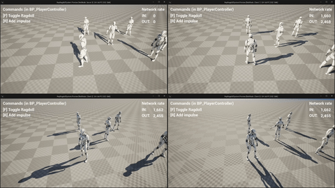

# Replicated Ragdoll System
This is a UE5 system that replicates Ragdoll's `Simulate Physics`.

## Demo Video

## Features
- Calculations are server-based.
- You can select the list of bones you want to replicate.
- You can choose the ragdoll replication frequency.
- The ragdoll automatically becomes dormant when it stops and wakes up immediately when it moves.
- It is component-based and can be attached to any `Actor` with a `SkeletalMeshComponent`.

## Usage
1. Select the `Actor` for which you want to replicate the simulation (must have a `SkeletalMeshComponent` with a valid `PhysicsAsset`).
2. Enable `bReplicates` on the `Actor`.
3. Attach the `RagdollSyncComponent`.
4. In the `RagdollSyncComponent` properties, find `DrivenBones` and enter the names of the bones you wish to replicate.
5. Configure the other properties to meet your desired conditions.

Note: This code prioritizes optimization. Therefore, jittering may occur if properties are set to extreme values or if the `PhysicsAsset` is unstable.

### Properties
| Property | Description |
| :--- | :--- |
| **DrivenBones** | A list of bones you want to replicate. |
| **SendHz** | The frequency at which to replicate to the client. |
| **PositionChangeThreshold**| Replicates when a bone's position changes by more than this value. |
| **RotationChangeThreshold**| Replicates when a bone's angle changes by more than this value. |
| **TeleportPositionThreshold**| If a bone needs to move more than this value, it will be teleported. |
| **TeleportRotationThreshold**| If a bone needs to rotate more than this value, it will be teleported. |
| **InterpDelaySeconds** | The delay time for interpolation. It's recommended to set this slightly higher than `SendHz`. |
| **EaseStrength** | The weight for the smoothing operation. |